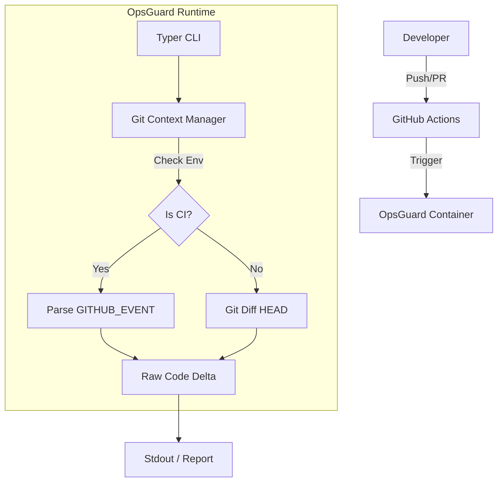

# OpsGuard-AI

> **Context-Aware Security Gate for GitHub Actions.**
> Validates deployments using Hybrid Analysis (Deterministic Rules + LLM Reasoning).

## Architecture (Day 1 Status)




OpsGuard-AI 🛡️🤖

    Context-Aware Security Gate for DevOps Pipelines. Validates code changes using Hybrid Analysis: Deterministic Regex Rules + LLM Reasoning (Semantic Analysis).

OpsGuard-AI no es solo un linter estático. Es un ingeniero de seguridad sintético que vive en tu terminal y CI/CD. Utiliza expresiones regulares para lo obvio (claves de AWS, RSA) y Modelos de Lenguaje (LLMs vía OpenRouter/Gemini) para entender la intención y detectar vulnerabilidades lógicas (Backdoors, SQL Injection, Credenciales hardcodeadas genéricas).


⚡ Quick Start (Instructor / Demo Mode)

Para verificar la eficacia de OpsGuard sin necesidad de configurar un pipeline completo, hemos incluido un "Campo de Tiro" (fixtures) con vulnerabilidades reales pero contenidas.

Prerrequisitos

    Python 3.12+

    Poetry (Gestor de dependencias)

Setup Local

    Clonar el repositorio:

```bash
git clone [https://github.com/oscaar90/OpsGuard-AI.git](https://github.com/oscaar90/OpsGuard-AI.git)
cd OpsGuard-AI
```

Instalar dependencias:

```bash
poetry run opsguard scan --path tests/fixtures/vulnerable_app
```

Resultado Esperado:

    🔴 Regex Block: Detectará el archivo aws_creds.env (Patrón AKIA...).

    🔴 AI Block: Detectará semánticamente:

        config.php: Credenciales 'admin' hardcodeadas (que el regex ignora).

        legacy_login.py: Vulnerabilidad de SQL Injection.


🏗️ Architecture

El sistema opera en dos fases estrictas para optimizar costes y latencia.

```mermaid
graph TD
    User[Developer] -->|Git Push/PR| CLI[OpsGuard CLI]
    
    subgraph "Phase 1: Deterministic Gate"
        CLI -->|Scan Diff| Regex[Regex Engine]
        Regex -->|Match Found?| Block1[❌ BLOCK PIPELINE]
    end
    
    subgraph "Phase 2: Semantic Gate"
        Regex -- No Matches --> AI[AI Engine (LLM)]
        AI -->|Reasoning| Analysis{Security Verdict}
        Analysis -- Risk Score > 7 --> Block2[❌ BLOCK PIPELINE]
        Analysis -- Safe --> Pass[✅ APPROVE DEPLOY]
    end
    
    Block1 & Block2 --> Report[Github Comment / Console Log]
```

Componentes Técnicos

    Core: Python 3.14 + Typer (CLI).

    Gatekeeper (Fase 1): Motor de Regex personalizado para alta entropía y patrones Cloud (AWS, GCP, Azure, Private Keys).

    Brain (Fase 2): Integración con OpenRouter (Agnóstico del proveedor: soporta Grok, Gemini 2.0, Claude 3.5, GPT-4).

    Context: Análisis inteligente de Git Diffs (solo analiza lo que cambia, no todo el repositorio).

🚀 Usage
Local Scan (Manual)

Escanea los cambios en tu directorio actual (Stage de Git):
```bash
poetry run opsguard scan
```

2. Modo Demo / Testing (Field Test)

Para verificar la detección híbrida (Regex + IA) sin modificar tu código, utiliza los fixtures incluidos:
```bash
poetry run opsguard scan --path tests/fixtures/vulnerable_app
```

Qué detectará:

    aws_creds.env: Bloqueado por Regex (Patrón AWS estático).

    config.php: Bloqueado por IA (Credenciales hardcodeadas genéricas).

    legacy_login.py: Bloqueado por IA (Vulnerabilidad SQL Injection).

🔧 Configuration

Las reglas de detección estática se definen en opsguard.yml. El motor de IA utiliza modelos vía OpenRouter (agnóstico del proveedor).
Parámetro	Descripción	Default
risk_score	Umbral de bloqueo de la IA (0-10)	7
model	Modelo LLM utilizado (gemini/grok/claude)	google/gemini-2.0-flash-001


TFM - Máster en Ingeniería de Software & IA Developed by Óscar Sánchez Pérez
