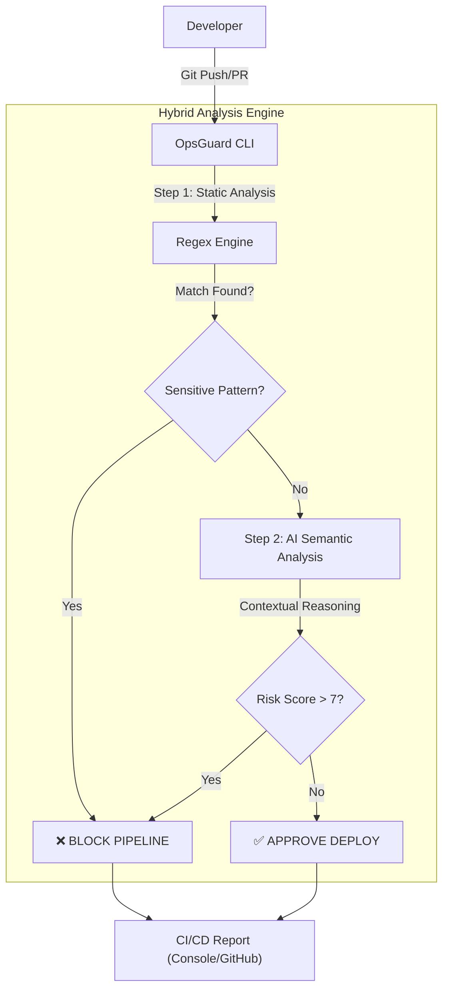

OpsGuard-AI 🛡️

Context-Aware Security Gate for DevOps Pipelines.

OpsGuard es una herramienta de Ingeniería de Plataforma diseñada para detener vulnerabilidades en el código antes de que lleguen a producción. A diferencia de los linters tradicionales, OpsGuard utiliza un Motor Híbrido que combina:

    Análisis Estático (Regex): Detección determinista de patrones de alta entropía (AWS Keys, Private Keys, Tokens).

    Análisis Semántico (IA): Uso de LLMs (vía OpenRouter) para entender la intención del código y detectar vulnerabilidades lógicas (SQL Injection, Backdoors, Credenciales hardcodeadas genéricas).

🏗️ Architecture

El sistema analiza los git diffs (solo el código nuevo) para optimizar costes y latencia en entornos CI/CD.
Fragmento de código


🚀 Installation & Setup
Prerrequisitos

    Python 3.12+

    Poetry (Gestor de dependencias)

1. Clonar el repositorio

```bash
git clone https://github.com/oscaar90/OpsGuard-AI.git
cd OpsGuard-AI
```
2. Instalar dependencias
```bash

poetry install
```
3. Configuración (.env)

OpsGuard necesita acceso a un proveedor de LLM (OpenRouter) para el análisis semántico. Crea un archivo .env en la raíz del proyecto:
Bash
```bash
# Crea el archivo .env
touch .env
```
Añade tu clave de API:
```ini
# .env
OPENROUTER_API_KEY="sk-or-v1-TuClaveAqui..."
OPSGUARD_RISK_THRESHOLD=7
```
⚙️ Usage

OpsGuard puede ejecutarse en modo local (hook de pre-commit) o en modo demostración.
Escaneo de Código (Git Stage)

Para escanear los cambios que estás a punto de subir (git add):
```bash
poetry run opsguard scan
```
⚡ Modo Demo (Shooting Range)

Hemos incluido una carpeta tests/fixtures/vulnerable_app con vulnerabilidades reales ("cebos") para probar la eficacia del motor sin comprometer el repositorio.

Ejecuta el escáner contra los archivos de prueba:

```bash
poetry run opsguard scan --path tests/fixtures/vulnerable_app
```
Resultados esperados en la demo:

    🔴 Bloqueo por Regex: Detectará aws_creds.env (Patrón AKIA...).

    🔴 Bloqueo por IA:

        config.php: Detectará credenciales 'admin' hardcodeadas (que el regex ignora).

        legacy_login.py: Detectará vulnerabilidad de SQL Injection.

🔧 CI/CD Integration

OpsGuard está diseñado para ejecutarse automáticamente en GitHub Actions. El flujo de trabajo se encuentra en .github/workflows/opsguard.yml y se activa en cada push o pull_request a la rama main.

Para que funcione en tu fork, asegúrate de añadir el secreto en GitHub:

    Settings > Secrets and variables > Actions > New Repository Secret: OPENROUTER_API_KEY.

    TFM - Máster en Ingeniería de Software & IA Proyecto final de implementación DevSecOps con Inteligencia Artificial.