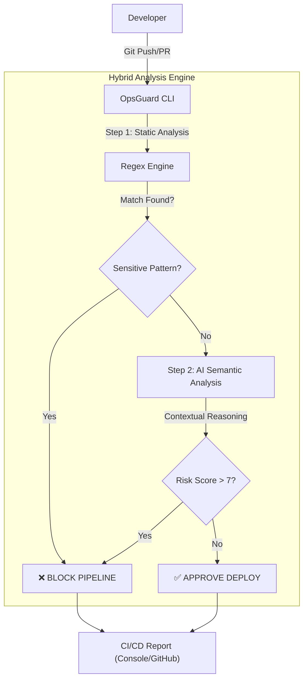

# 🛡️ OpsGuard-AI
> **Context-Aware Security Gate for DevOps Pipelines.**


OpsGuard es una herramienta de Ingeniería de Plataforma diseñada para detener vulnerabilidades antes de que lleguen a producción. Combina **Regex de Alta Entropía** con **Análisis Semántico (LLM)** para reducir falsos positivos.


---

## 📂 Documentación Técnica (Engineering Standards)
Para profundizar en las decisiones de arquitectura, costes y privacidad, consulte los **Architecture Decision Records (ADR)**:
- [ADR-001: Patrón Gatekeeper Local](/docs/adr/0001-patron-gatekeeper-local.md)
- [ADR-002: Prompt Engineering & English Tokens](/docs/adr/0002-prompting-en-ingles.md)
- [ADR-003: Telemetría y FinOps](/docs/adr/0003-telemetria-y-finops.md)

---

## 🤝 Estándares de Desarrollo (Conventional Commits)
Este proyecto sigue estrictamente la especificación **[Conventional Commits](https://www.conventionalcommits.org/)** para asegurar un historial de Git legible y automatizable.

| Tipo | Descripción | Ejemplo |
| :--- | :--- | :--- |
| `feat` | Nueva funcionalidad | `feat: add AI semantic analysis engine` |
| `fix` | Corrección de error | `fix: resolve regex pattern for AWS keys` |
| `docs` | Cambios en documentación | `docs: add ADR 001 and architecture diagrams` |
| `chore` | Mantenimiento / Configuración | `chore: update poetry dependencies` |
| `test` | Tests unitarios o de integración | `test: add shooting range fixtures` |

> **Nota:** Esto facilita la Trazabilidad y la generación automática de Changelogs.


## ⚡ Quick Start (Modo Evaluación)
Siga estos pasos para probar la herramienta en local sin necesidad de configurar GitHub Actions.

### 1. Instalación
Requisitos: Python 3.12+ y [Poetry](https://python-poetry.org/docs/).


```bash
# 1. Clonar repositorio
git clone [https://github.com/oscaar90/OpsGuard-AI.git](https://github.com/oscaar90/OpsGuard-AI.git)
cd OpsGuard-AI

# 2. Instalar dependencias (Entorno virtual aislado)
poetry install
```

2. Configuración
```bash
Renombre el archivo de ejemplo y añada la API Key proporcionada en la entrega del proyecto.

cp .env.example .env
```
# Edite .env y pegue la variable OPENROUTER_API_KEY


3. Ejecutar Prueba de Concepto (Shooting Range)

Hemos incluido una suite de archivos vulnerables (tests/fixtures) para demostrar la detección.

Comando:
```bash
poetry run opsguard scan --path tests/fixtures/vulnerable_app
```

🏗️ Arquitectura del Motor

El sistema analiza los git diffs para optimizar costes y latencia.


    🔴 BLOCK (Regex): aws_creds.env (AWS Key detectada).

    🔴 BLOCK (AI Semántico): legacy_login.py (SQL Injection detectada).

    ✅ PASS: Archivos de documentación y código seguro.



🔧 Integración CI/CD (GitHub Actions)

Para integrar OpsGuard en un repositorio de producción:

    Copiar el workflow: .github/workflows/opsguard.yml.

    Definir el secreto en GitHub: Settings > Secrets > Actions > OPENROUTER_API_KEY.

    El pipeline bloqueará automáticamente cualquier PR que introduzca vulnerabilidades.

    🧪 Evidencias de Ejecución

Puede consultar logs reales y capturas de funcionamiento en la carpeta de evidencias: 👉  [Ver Logs y Capturas](/docs/evidence)