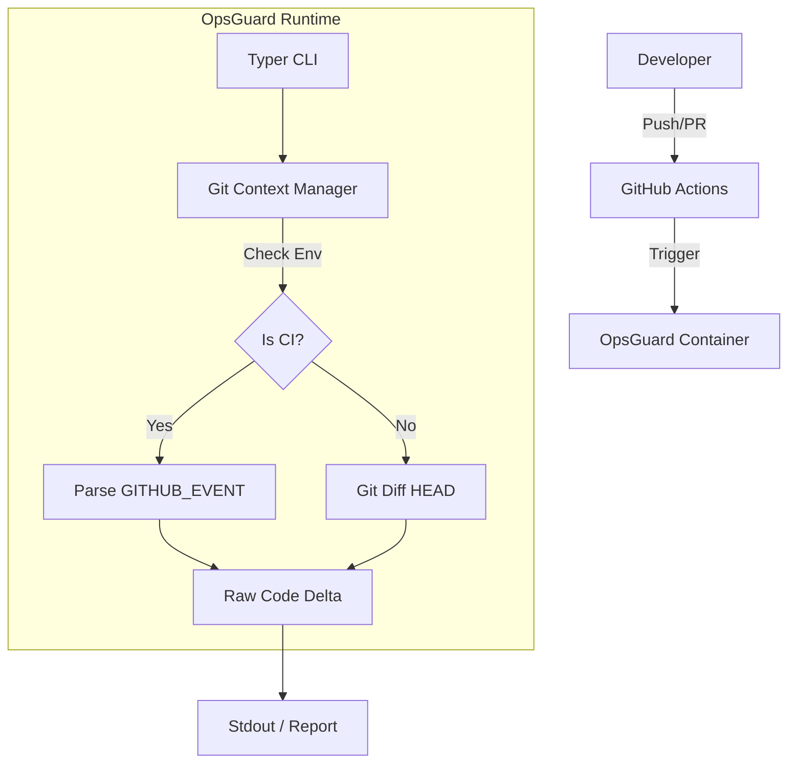
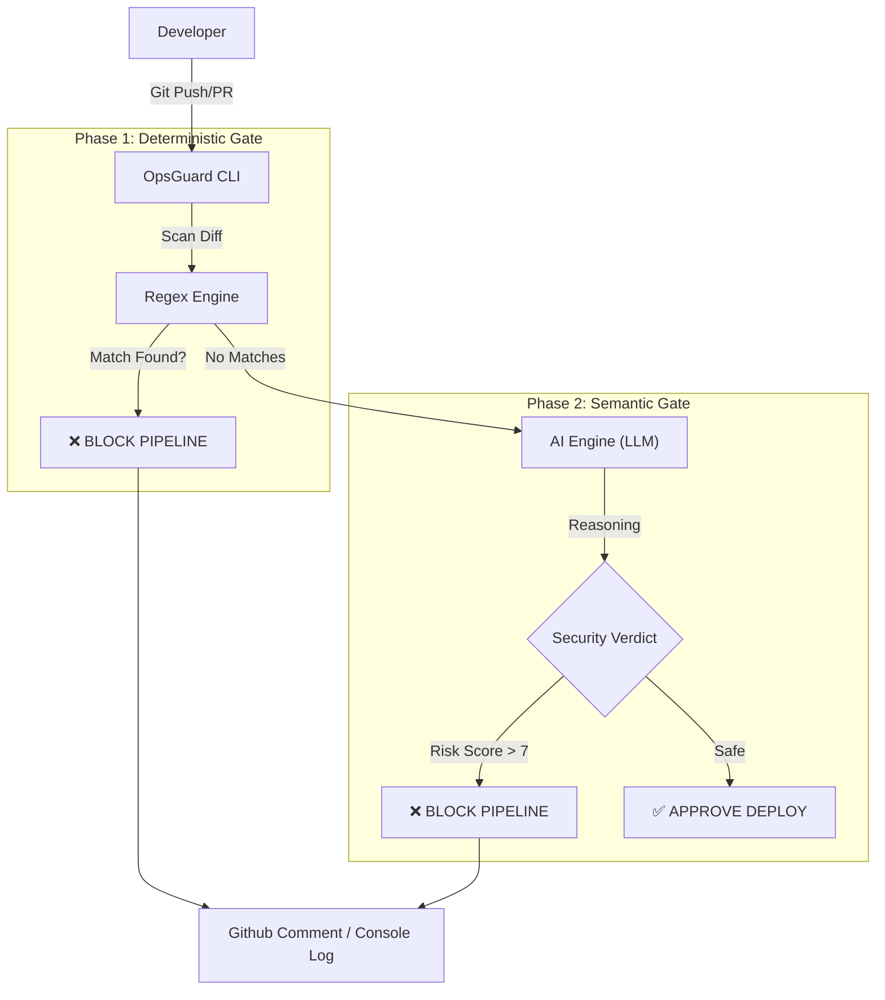

# OpsGuard-AI

> **Context-Aware Security Gate for GitHub Actions.**
> Validates deployments using Hybrid Analysis (Deterministic Rules + LLM Reasoning).

## Architecture (Day 1 Status)




OpsGuard-AI 🛡️🤖

    Context-Aware Security Gate for DevOps Pipelines. Validates code changes using Hybrid Analysis: Deterministic Regex Rules + LLM Reasoning (Semantic Analysis).

OpsGuard-AI no es solo un linter estático. Es un ingeniero de seguridad sintético que vive en tu terminal y CI/CD. Utiliza expresiones regulares para lo obvio (claves de AWS, RSA) y Modelos de Lenguaje (LLMs vía OpenRouter/Gemini) para entender la intención y detectar vulnerabilidades lógicas (Backdoors, SQL Injection, Credenciales hardcodeadas genéricas).


⚡ Quick Start (Instructor / Demo Mode)

Para verificar la eficacia de OpsGuard sin necesidad de configurar un pipeline completo, hemos incluido un "Campo de Tiro" (fixtures) con vulnerabilidades reales pero contenidas.

Prerrequisitos

    Python 3.12+ & Poetry.

    Una API Key válida de OpenRouter en tu archivo .env:

```bash
OPENROUTER_API_KEY=sk-or-v1-...
```


Pasos para la Demo

Ejecuta el escáner contra la carpeta de pruebas vulnerables:

```bash
poetry run opsguard scan --path tests/fixtures/vulnerable_app
```

Resultado Esperado:

    🔴 Regex Block: Detectará el archivo aws_creds.env (Patrón AKIA...).

    🔴 AI Block: Detectará semánticamente:

        config.php: Credenciales 'admin' hardcodeadas (que el regex ignora).

        legacy_login.py: Vulnerabilidad de SQL Injection.


🏗️ Architecture

El sistema opera en dos fases estrictas para optimizar costes y latencia.



Componentes Técnicos

    Core: Python 3.14 + Typer (CLI).

    Gatekeeper (Fase 1): Motor de Regex personalizado para alta entropía y patrones Cloud (AWS, GCP, Azure, Private Keys).

    Brain (Fase 2): Integración con OpenRouter (Agnóstico del proveedor: soporta Grok, Gemini 2.0, Claude 3.5, GPT-4).

    Context: Análisis inteligente de Git Diffs (solo analiza lo que cambia, no todo el repositorio).

🚀 Usage
Local Scan (Manual)

Escanea los cambios en tu directorio actual (Stage de Git):
```bash
# Escanea archivos en el stage (git add)
poetry run opsguard scan

# Escanea un directorio específico
poetry run opsguard scan --path ./src
``` 

Configuration

El comportamiento se define en opsguard.yml (reglas regex) y variables de entorno:

Variable	Descripción
OPENROUTER_API_KEY	Requerido. Tu llave para el motor de IA.
OPSGUARD_RISK_THRESHOLD	(Opcional) Nivel de riesgo para bloquear (Default: 7/10).

🛡️ Security & Privacy

OpsGuard implementa una estrategia de Privacidad por Diseño (Privacy by Design):

    Filtrado Local: Las credenciales obvias (AWS Keys, etc.) son bloqueadas localmente por el Regex y NUNCA se envían a la nube (LLM).

    Contexto Mínimo: Solo se envía al LLM el git diff (las líneas añadidas), no el repositorio completo.

    Zero Retention: Se utilizan proveedores de API Enterprise que no entrenan modelos con los datos enviados.

```text
.
├── config/             # Reglas predeterminadas
├── src/
│   ├── ai.py           # Cliente OpenRouter + Lógica de Retry
│   ├── detector.py     # Motor Regex (Validación estática)
│   ├── git_utils.py    # Extracción de contexto Git
│   └── main.py         # Orquestador CLI
├── tests/
│   └── fixtures/       # Archivos vulnerables para Demo
└── opsguard.yml        # Configuración de reglas
```
TFM - Máster en Ingeniería de Software & IA Developed by Óscar Sánchez Pérez
