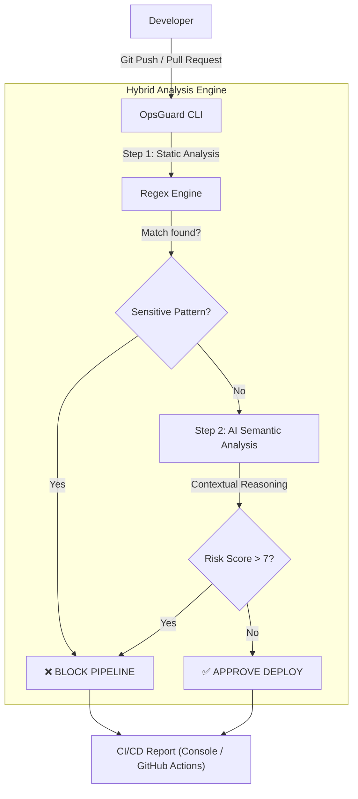
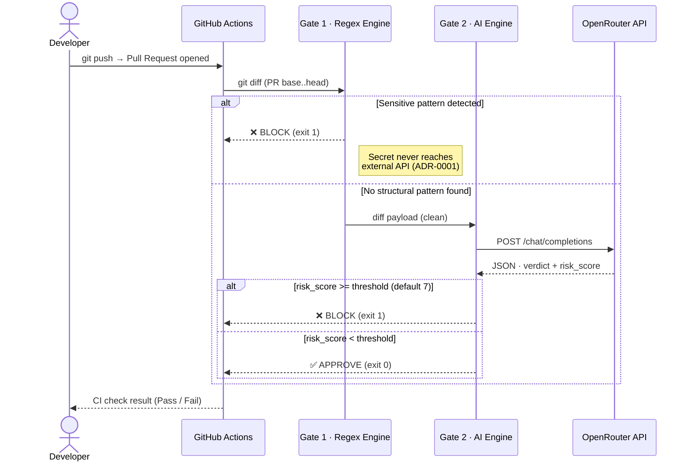

# 🛡️ OpsGuard AI

> **Stop a leaked secret from destroying your production environment — before the damage is done.**


---

## The Problem

Every week, developers accidentally push passwords, API keys, and database credentials to GitHub.

Sometimes it's a `.env` file committed by mistake. Sometimes it's a hardcoded token left in a test. Sometimes it's a subtle SQL injection hiding inside what looks like normal code.

The consequences are real: **stolen data, compromised infrastructure, six-figure cloud bills, and public incidents that end careers.**

Traditional security tools help — but they either miss the subtle ones, or they cry wolf so often that developers start ignoring the alerts.

**OpsGuard was built to fix that.**

---

## What OpsGuard Does

OpsGuard sits inside your development pipeline and acts as a **security checkpoint**: every time a developer tries to push code, OpsGuard reviews it automatically.

Think of it as a bouncer at the door. Fast, smart, and hard to fool.

It works in two stages:

1. **Speed check** — A rule-based engine instantly scans for known dangerous patterns: API keys, passwords, tokens, suspicious credentials. If it finds one, it blocks the push immediately.

2. **Intelligence check** — If nothing obvious is found, an AI reads the code and *understands what it does*. It can detect things no rule can catch — like a login function that bypasses authentication, or a database query that can be manipulated by an attacker.

Only code that passes both gates reaches production.

---

## Why OpsGuard? Comparison with Existing Tools

The DevSecOps ecosystem already has mature tools. OpsGuard doesn't replace them — it covers the specific gap none of them address: **semantic analysis of complex logic with guaranteed privacy**.

| Capability | Gitleaks | Semgrep | Trivy | **OpsGuard** |
|-----------|:--------:|:-------:|:-----:|:------------:|
| Secret detection (Regex) | ✅ | ✅ | ❌ | ✅ Gate 1 |
| AI semantic analysis | ❌ | ⚠️ Limited | ❌ | ✅ Gate 2 |
| SQL Injection detection (logical) | ❌ | ⚠️ Patterns | ❌ | ✅ Contextual |
| Logic backdoor detection | ❌ | ❌ | ❌ | ✅ |
| Domain typosquatting detection | ❌ | ❌ | ❌ | ✅ |
| Secrets never leave your environment | ✅ | ❌ SaaS | ✅ | ✅ ADR-0001 |
| Native GitHub Actions integration | ✅ | ✅ | ✅ | ✅ |
| Inference cost | Free | Free/Paid | Free | ~$0.001/PR |
| Swappable AI model | ❌ | ❌ | ❌ | ✅ Env var |

> **Recommended pattern:** OpsGuard and Trivy are complementary, not competitors. Trivy audits dependencies; OpsGuard audits the logic of new code entering via PR.

---

## What It Catches

| Type | Example | Detection |
|------|---------|-----------|
| AWS credentials | `AKIA...` keys in any file | ❌ Blocked instantly |
| Database passwords | Hardcoded `db_password = "..."` | ❌ Blocked instantly |
| SQL Injection | Login logic vulnerable to `' OR 1=1` | ❌ Blocked by AI |
| Logic backdoors | Auth checks that can be bypassed | ❌ Blocked by AI |
| Supply chain attacks | Domain typosquatting (`ghrc.io` vs `ghcr.io`) | ❌ Blocked by AI |
| Clean code | Normal application logic | ✅ Approved |
| Documentation | Comments, README files | ✅ Approved |

---

## See It In Action

Run OpsGuard against the included test suite of intentionally vulnerable files:

```bash
poetry run opsguard scan --path tests/fixtures/vulnerable_app
```

**Gate 1 — Regex Engine:** An AWS key is detected and the pipeline is blocked instantly, before any AI call is made.


**Gate 2 — AI Semantic Analysis:** No obvious pattern found, but the AI reads the logic and identifies a SQL Injection and a hardcoded backdoor. Risk Score: 9/10.


Real execution logs and screenshots are available in [`/docs/evidence`](/docs/evidence).

---

## Get Started

**Requirements:** Python 3.12+ and [Poetry](https://python-poetry.org/docs/)

```bash
# 1. Clone the repository
git clone https://github.com/oscaar90/OpsGuard-AI.git
cd OpsGuard-AI

# 2. Install dependencies
poetry install

# 3. Add your API key and model
cp .env.example .env
# Open .env and fill in OPENROUTER_API_KEY and AI_MODEL
```

That's it. Run the scan command above and see it work.

> **Where do I get an API key?**
> OpsGuard uses [OpenRouter](https://openrouter.ai/) as the AI gateway. Create a free account, generate a key, and set it in your `.env`:
> ```
> OPENROUTER_API_KEY=your_key_here
> AI_MODEL=your_preferred_model
> ```
> OpenRouter gives you access to hundreds of models — Gemini, GPT-4, Claude, Mistral, and more. Use whichever fits your needs or budget.

---

## How It Fits Into Your Workflow

OpsGuard is designed to run automatically — you don't have to remember to use it.


```mermaid
graph TD
    User[Developer] -->|Git Push / Pull Request| CLI[OpsGuard CLI]

    subgraph "Hybrid Analysis Engine"
        CLI -->|Step 1: Static Analysis| Regex[Regex Engine]
        Regex -->|Match found?| Gate1{Sensitive Pattern?}

        Gate1 -- Yes --> Block["❌ BLOCK PIPELINE"]
        Gate1 -- No --> AI["Step 2: AI Semantic Analysis"]

        AI -->|Contextual Reasoning| Gate2{Risk Score > 7?}
        Gate2 -- Yes --> Block
        Gate2 -- No --> Pass["✅ APPROVE DEPLOY"]
    end

    Block & Pass --> Report["CI/CD Report (Console / GitHub Actions)"]
```


```mermaid
sequenceDiagram
    actor Dev as Developer
    participant GHA as GitHub Actions
    participant G1 as Gate 1 · Regex Engine
    participant G2 as Gate 2 · AI Engine
    participant OR as OpenRouter API

    Dev->>GHA: git push → Pull Request opened
    GHA->>G1: git diff (PR base..head)

    alt Sensitive pattern detected
        G1-->>GHA: ❌ BLOCK (exit 1)
        Note right of G1: Secret never reaches<br/>external API (ADR-0001)
    else No structural pattern found
        G1->>G2: diff payload (clean)
        G2->>OR: POST /chat/completions
        OR-->>G2: JSON · verdict + risk_score

        alt risk_score >= threshold (default 7)
            G2-->>GHA: ❌ BLOCK (exit 1)
        else risk_score < threshold
            G2-->>GHA: ✅ APPROVE (exit 0)
        end
    end

    GHA-->>Dev: CI check result (Pass / Fail)
```

For production use, OpsGuard runs automatically via GitHub Actions on every push and pull request. No manual steps needed.

Configuration: `.github/workflows/opsguard.yml`
Required secret: `OPENROUTER_API_KEY` → set it once in your repository settings.

---

## Integrate OpsGuard in 5 Minutes

OpsGuard is available as a reusable **GitHub Action**. Any team can add it to their pipeline without cloning the repo or managing dependencies.

**Step 1 — Add the secret**

In your repository: **Settings → Secrets and variables → Actions → New repository secret**

```
Name:  OPENROUTER_API_KEY
Value: <your openrouter.ai api key>
```

**Step 2 — Create the workflow**

Create `.github/workflows/security.yml` in your repository:

```yaml
name: OpsGuard Security Gate

on:
  pull_request:
    types: [opened, synchronize, reopened]

jobs:
  security-scan:
    name: OpsGuard Scan
    runs-on: ubuntu-latest
    permissions:
      contents: read

    steps:
      - name: Checkout
        uses: actions/checkout@v4
        with:
          fetch-depth: 0

      - name: OpsGuard Security Scan
        uses: oscaar90/OpsGuard-AI@v1
        with:
          openrouter-api-key: ${{ secrets.OPENROUTER_API_KEY }}
```

Open a PR and OpsGuard will automatically block any change containing secrets, logic vulnerabilities, or supply-chain attacks.

---

## Real-World Case: Supply-Chain Attack Detection

In February 2025, the domain **`ghrc.io`** — a deliberate transposition of **`ghcr.io`** (GitHub Container Registry) — was discovered as an active attack vector. A developer who types `ghrc.io` in a `Dockerfile` could unknowingly send corporate images to an attacker-controlled registry.

No static scanner catches this. The domain is syntactically valid. Only contextual reasoning can identify the anomaly.

**OpsGuard result against the included fixture:**

| Engine | Result | Detail |
|--------|:------:|--------|
| **Gate 1 - Regex** | ✅ PASS | No deterministic pattern for domain typosquatting |
| **Gate 2 - AI** | ❌ **BLOCK** | `risk_score: 7/10` — correctly flagged `ghrc.io` as typosquatting of `ghcr.io` |

---

## Real-World Case: Safety Net for AI Agents

Autonomous AI agents (GitHub Copilot Workspace, Cursor Agent, Devin...) can now open Pull Requests autonomously. This introduces two new risk categories: **credentials by hallucination** and **insecure generated logic**.

OpsGuard blocks both. When an AI agent generates a payment service with SQL injection and an auth bypass header, Gate 2 catches it before it reaches main:

```
❌ Verdict: BLOCK | Risk Score: 9/10

CRITICAL │ src/payment_service.py │ SQL injection - username interpolated directly
CRITICAL │ src/payment_service.py │ SQL injection - unsanitized f-string
MEDIUM   │ src/payment_service.py │ Auth bypass via X-INTERNAL-ADMIN header
```

> OpsGuard is the security reviewer that never sleeps and cannot be pressured into approving a vulnerable PR.

---

## For the Technical Reader

Architecture decisions are documented in the **ADR (Architecture Decision Records)**:

- [ADR-001: Local Gatekeeper Pattern](/docs/adr/0001-patron-gatekeeper-local.md)
- [ADR-002: Prompt Engineering in English](/docs/adr/0002-prompting-en-ingles.md)
- [ADR-003: Telemetry & FinOps](/docs/adr/0003-telemetria-y-finops.md)
- [ADR-004: Fail-Closed Policy (Gate 2)](/docs/adr/0004-fail-closed-policy.md)
- [ADR-005: Diff Truncation Strategy](/docs/adr/0005-diff-truncation-strategy.md)

**Tech stack:** Python 3.12 · Poetry · OpenRouter (model-agnostic) · Typer · Rich · GitHub Actions · Pytest

**Full model benchmark report:** [`docs/benchmark-models.md`](/docs/benchmark-models.md)

---

## Contributing

This project follows **[Conventional Commits](https://www.conventionalcommits.org/)**.

| Type | Use for |
|------|---------|
| `feat` | New feature |
| `fix` | Bug fix |
| `docs` | Documentation changes |
| `chore` | Maintenance / config |
| `test` | Tests |

---

## License

This project is licensed under the **GNU Affero General Public License v3.0 (AGPL-3.0)**.

You are free to use, study, modify, and distribute this software — as long as any derivative work is also released under the same license. If you use OpsGuard as part of a network service, you must also make your modifications publicly available.

**In short:** use it freely, improve it openly, but you cannot take it and close it.

For commercial licensing or partnership inquiries: oscar@oscarai.tech

See the [LICENSE](LICENSE) file for full terms.

---

**Built by [Óscar Sánchez Pérez](https://github.com/oscaar90)**

If OpsGuard saved your pipeline — or you just think the idea is solid — give it a ⭐ and share it. The project is actively evolving and contributions are welcome.
