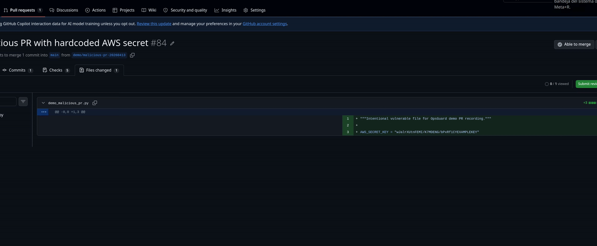

<!-- LOGO + TAGLINE -->
<p align="center">
  <!-- Logo placeholder — add docs/assets/logo.png when ready -->
  <br/>
  <strong>🛡️ OpsGuard AI</strong>
  <br/>
  The AI-powered security gate for your GitHub Actions pipeline.
  <br/>
  <em>Blocks vulnerable code before it reaches production. Zero config.</em>
</p>

<!-- BADGES -->
<p align="center">
  <a href="https://github.com/oscaar90/OpsGuard-AI/stargazers"></a>
  <a href="https://github.com/oscaar90/OpsGuard-AI/blob/main/LICENSE"></a>
  <a href="https://github.com/oscaar90/OpsGuard-AI/actions"></a>
  <a href="https://github.com/oscaar90/OpsGuard-AI/issues"></a>
  
  
</p>

<!-- LANGUAGE LINKS -->
<p align="center">
  <a href="README.md">English</a> · <a href="README_ES.md">Español</a>
</p>

---

<!-- GIF DEMO — uncomment when demo.gif is ready
## See it in Action



> A pull request with a hardcoded AWS key gets submitted → OpsGuard scans it → blocks the merge → opens a GitHub Issue with the full report.

---
-->

## The Problem

Every day, developers push code that contains security risks: hardcoded secrets, SQL injection patterns, backdoors left from debugging, or vulnerabilities silently introduced by AI code assistants like Copilot or Cursor.

Traditional scanners look for exact keyword matches. They miss context. They miss the subtle things.

**OpsGuard reads the code the way a security engineer would** — and it lives in your CI pipeline.

---

## How It Works

OpsGuard runs a two-gate pipeline on every pull request:

**Gate 1 — Local Gatekeeper (regex, milliseconds)**
Scans for hardcoded secrets and known-bad patterns entirely on your infrastructure. Nothing leaves your environment.

**Gate 2 — AI Brain (LLM, ~$0.001/scan)**
If Gate 1 passes, the diff is sent to an LLM for semantic analysis. It understands context: what the code *does*, not just what it *says*.

If either gate triggers → the PR is blocked and a GitHub Issue is opened with a detailed remediation report.

```
Git Diff → Gate 1: Regex (local) → Gate 2: LLM (semantic) → Report
```

---

## Get Started in 2 Minutes

1. Get a free API key at [OpenRouter](https://openrouter.ai).
2. Add it to your repo: *Settings → Secrets → New secret* → name it `OPENROUTER_API_KEY`.
3. Create `.github/workflows/opsguard.yml` in your repo:

```yaml
name: OpsGuard Security Gate

on:
  pull_request:
    types: [opened, synchronize, reopened]

jobs:
  security-scan:
    runs-on: ubuntu-latest
    permissions:
      contents: read
    steps:
      - uses: actions/checkout@v4
        with:
          fetch-depth: 0
      - uses: oscaar90/OpsGuard-AI@v1
        with:
          openrouter-api-key: ${{ secrets.OPENROUTER_API_KEY }}
```

That's it. Every PR from now on goes through the security gate.

---

## What It Catches

- Hardcoded secrets — AWS keys, Stripe tokens, GitHub PATs, database passwords
- Injection attacks — SQL injection, command injection patterns
- Active backdoors — test hooks, debug endpoints left in production code
- Typosquatting — dependency names pointing to malicious packages
- AI-generated vulnerabilities — insecure patterns introduced by Copilot, Cursor, or similar tools

[See real examples of code blocked by OpsGuard](./docs/ejemplos-reales.md)

---

## Why OpsGuard vs Traditional Tools

| Feature | OpsGuard AI | Snyk | SonarQube | Semgrep |
|---------|:-----------:|:----:|:---------:|:-------:|
| LLM semantic analysis | ✅ | ❌ | ❌ | ❌ |
| Zero-config GitHub Action | ✅ | ❌ | ❌ | ⚠️ |
| Secrets stay local (Gate 1) | ✅ | ✅ | ❌ | ✅ |
| AI-generated code audit | ✅ | ❌ | ❌ | ❌ |
| Cost per scan | ~$0.001 | Free tier | Free tier | Free tier |
| Auto GitHub Issue on block | ✅ | ❌ | ❌ | ❌ |

[Full benchmark and model comparison](./docs/benchmark-models.md)

---

## Key Design Decisions

- Gate 1 always runs locally — secrets never leave your environment before being caught (ADR-0001)
- All LLM prompts are in English to reduce hallucinations (ADR-0002)
- Fail-closed: any error produces a BLOCK verdict, not a pass (ADR-0004)
- Diffs are truncated at 30 KB to keep costs predictable (ADR-0005)

Full architecture decisions in [`docs/adr/`](./docs/adr/).

---

## Documentation

- [Local setup and testing guide](./docs/guia-local.md)
- [Architecture Decision Records (ADRs)](./docs/adr/)
- [AI strategy and prompts](./prompts/)
- [Changelog](./CHANGELOG.md)

---

## License

OpsGuard AI uses a **dual license model**:

- **Open Source (AGPLv3)** — free for personal projects, open-source, and non-production use. See [LICENSE](LICENSE).
- **Commercial License** — required for closed corporate environments or when AGPLv3 copyleft is incompatible with your stack.

For commercial licensing: **oscar@oscarai.tech**

---

<p align="center">
  <em>Built as a Master's Thesis (TFM) — graded <strong>Excellent</strong>.</em>
  <br/>
  <a href="https://ops-guard-ai-35ac.vercel.app/">Website</a> · <a href="https://github.com/oscaar90/OpsGuard-AI/issues">Issues</a> · <a href="mailto:oscar@oscarai.tech">Contact</a>
</p>
