# 🛡️ OpsGuard-AI
> **Context-Aware Security Gate for DevOps Pipelines.**


OpsGuard es una herramienta de Ingeniería de Plataforma diseñada para detener vulnerabilidades antes de que lleguen a producción. Combina **Regex de Alta Entropía** (detección determinista) con **Análisis Semántico por IA** (razonamiento lógico) para reducir falsos positivos y asegurar el ciclo de vida del desarrollo.

---

## ✨ Funcionalidades Principales
- **🛡️ Hybrid Analysis Engine:** Fusión de análisis estático (velocidad) y LLMs (contexto).
- **🧠 Semantic Logic Check:** Detecta vulnerabilidades complejas como Inyecciones SQL o Backdoors lógicos que el Regex ignora.
- **⚡ Zero-Latency Focus:** Filtrado inteligente para no bloquear el pipeline innecesariamente.
- **📝 Automated Audit Logs:** Generación de evidencias forenses en cada ejecución.

---

## 🛠️ Stack Tecnológico
Este proyecto ha sido construido utilizando estándares modernos de Ingeniería de Software:

- **Lenguaje Core:** Python 3.12+
- **Gestión de Dependencias:** Poetry (Aislamiento de entornos).
- **IA & NLP:** OpenRouter / Google Gemini Flash 2.0 (Motor de inferencia).
- **CLI Framework:** Typer & Rich (Interfaz de terminal interactiva).
- **CI/CD:** GitHub Actions (Automatización del pipeline).
- **Validación:** Pytest (Testing unitario) & Pre-commit hooks.

---

## 📂 Estructura del Proyecto
Organización modular del código fuente:

```text
OpsGuard-AI/
├── .github/workflows/    # Pipelines de CI/CD (GitHub Actions)
├── docs/                 # Documentación del proyecto
│   ├── adr/              # Architecture Decision Records (Decisiones técnicas)
│   └── evidence/         # Capturas y logs de auditoría (Pruebas de ejecución)
├── src/                  # Código fuente de la aplicación
│   ├── ai.py             # Motor de análisis semántico (Cliente LLM)
│   ├── security.py       # Motor de análisis estático (Regex Patterns)
│   ├── console_ui.py     # Interfaz de usuario (Rich/Typer)
│   ├── ingest.py         # Procesamiento de Git Diffs y lectura de archivos
│   └── main.py           # Punto de entrada (Entrypoint)
├── tests/                # Suite de tests y fixtures (Shooting Range)
├── .env.example          # Plantilla de variables de entorno
├── pyproject.toml        # Configuración de dependencias (Poetry)
└── README.md             # Punto de entrada de documentación
```

---

## 📂 Documentación Técnica (Engineering Standards)
Para profundizar en las decisiones de arquitectura, costes y privacidad, consulte los **Architecture Decision Records (ADR)**:
- [ADR-001: Patrón Gatekeeper Local](/docs/adr/0001-patron-gatekeeper-local.md)
- [ADR-002: Prompt Engineering & English Tokens](/docs/adr/0002-prompting-en-ingles.md)
- [ADR-003: Telemetría y FinOps](/docs/adr/0003-telemetria-y-finops.md)

---

## ⚡ Quick Start (Modo Evaluación)
Siga estos pasos para probar la herramienta en local sin necesidad de configurar GitHub Actions.

### 1. Instalación
Requisitos: Python 3.12+ y [Poetry](https://python-poetry.org/docs/).

```bash
# 1. Clonar repositorio
git clone [https://github.com/oscaar90/OpsGuard-AI.git](https://github.com/oscaar90/OpsGuard-AI.git)
cd OpsGuard-AI

# 2. Instalar dependencias (Entorno virtual aislado)
poetry install
```

### 2. Configuración
Renombre el archivo de ejemplo y añada la API Key proporcionada en la entrega del proyecto.
```bash
cp .env.example .env
# Edite .env y pegue la variable OPENROUTER_API_KEY
```

### 3. Ejecutar Prueba de Concepto (Shooting Range)
Hemos incluido una suite de archivos vulnerables (`tests/fixtures`) para demostrar la detección.

**Comando:**
```bash
poetry run opsguard scan --path tests/fixtures/vulnerable_app
```

**Resultados Esperados:**
- 🔴 **BLOCK (Regex):** `aws_creds.env` (AWS Key detectada).
- 🔴 **BLOCK (AI Semántico):** `legacy_login.py` (SQL Injection detectada).
- ✅ **PASS:** Archivos de documentación y código seguro.

---

## 🏗️ Arquitectura del Motor
El sistema analiza los `git diffs` para optimizar costes y latencia mediante un flujo de doble puerta (Two-Gate System).

```mermaid
graph TD
    User[Developer] -->|Git Push/PR| CLI[OpsGuard CLI]
    
    subgraph "Hybrid Analysis Engine"
        CLI -->|Step 1: Static Analysis| Regex[Regex Engine]
        Regex -->|"Match Found?"| Gate1{Sensitive Pattern?}
        
        Gate1 -- Yes --> Block["❌ BLOCK PIPELINE"]
        Gate1 -- No --> AI["Step 2: AI Semantic Analysis"]
        
        AI -->|Contextual Reasoning| Gate2{Risk Score > 7?}
        Gate2 -- Yes --> Block
        Gate2 -- No --> Pass["✅ APPROVE DEPLOY"]
    end
    
    Block & Pass --> Report["CI/CD Report (Console/GitHub)"]
```



---

## 🤝 Estándares de Desarrollo (Conventional Commits)
Este proyecto sigue estrictamente la especificación **[Conventional Commits](https://www.conventionalcommits.org/)**.

| Tipo | Descripción | Ejemplo |
| :--- | :--- | :--- |
| `feat` | Nueva funcionalidad | `feat: add AI semantic analysis engine` |
| `fix` | Corrección de error | `fix: resolve regex pattern for AWS keys` |
| `docs` | Cambios en documentación | `docs: add ADR 001` |
| `chore` | Mantenimiento / Configuración | `chore: update poetry dependencies` |
| `test` | Tests unitarios o de integración | `test: add shooting range fixtures` |

---

## 🔧 Integración CI/CD
Para producción, OpsGuard se ejecuta automáticamente en GitHub Actions.
1. Workflow: `.github/workflows/opsguard.yml`.
2. Secretos requeridos: `OPENROUTER_API_KEY`.

### 🧪 Evidencias de Ejecución
Puede consultar logs reales y capturas de funcionamiento en la carpeta de evidencias:
👉 [Ver Logs y Capturas](/docs/evidence)

---
**TFM - Máster en Desarrollo con IA** | Óscar Sánchez Pérez